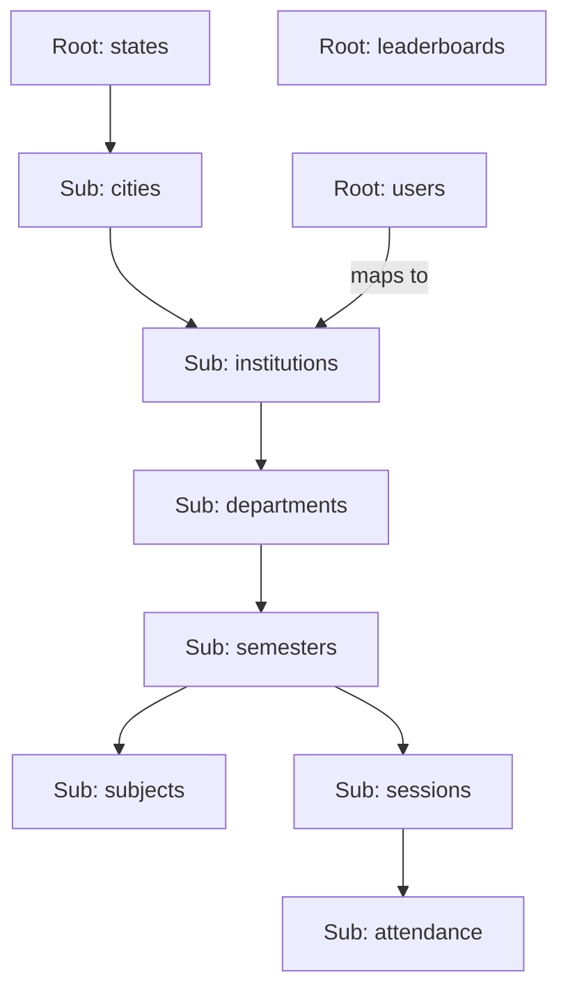

# SecureAttend Firestore Scalability Redesign

This document outlines a multi-state, multi-institution Firestore architecture designed to support thousands of institutions, granular role-based access, and future analytics/leaderboards.

## 1. Firestore Collection Structure

To balance the requested hierarchy with Firestore query efficiency, we use a hybrid approach of **nested subcollections** for logical grouping and **root collections** for global entities (like users) to simplify authentication.

### Hierarchy Map


---

## 2. Document Schemas & Examples

### `/users/{uid}`
Essential for routing and security rules.
```json
{
  "role": "student", // or "lecturer"
  "email": "student@inst.edu",
  "stateId": "karnataka",
  "cityId": "bangalore",
  "instId": "rvce_001",
  "deptId": "cse",
  "semId": "sem_6",
  "profile": {
    "name": "John Doe",
    "usn": "1RV21CS001",
    "deviceId": "android_id_8899"
  }
}
```

### `/states/{stateId}/cities/{cityId}/institutions/{instId}`
Contains institution-level configuration and metadata.
```json
{
  "name": "R.V. College of Engineering",
  "type": "University",
  "stats": {
    "totalStudents": 4500,
    "avgAttendance": 82.5
  }
}
```

### `/.../semesters/{semId}/subjects/{subjectId}`
```json
{
  "name": "Machine Learning",
  "code": "CS61",
  "lecturerUid": "lect_uid_123",
  "credits": 4
}
```

### `/.../semesters/{semId}/sessions/{sessionId}`
```json
{
  "subjectId": "CS61",
  "lecturerUid": "lect_uid_123",
  "startTime": "2026-07-31T10:00:00Z",
  "endTime": null, // Active if null
  "isActive": true,
  "geoBoundary": {
    "lat": 12.923,
    "lng": 77.498,
    "radius": 20
  },
  "stats": {
    "present": 45,
    "absent": 5,
    "suspicious": 2
  }
}
```

### `/.../sessions/{sessionId}/attendance/{studentUsn}`
Subcollection to avoid the 1MB document size limit.
```json
{
  "timestamp": "2026-07-31T10:05:00Z",
  "rssi": -55,
  "isSuspect": false,
  "verifiedBy": "ble_geofence"
}
```

---

## 3. Query Optimization Strategy

1.  **Avoid Document Bloat:** Never store attendance lists as arrays inside a session document. Using the `attendance` subcollection allows for infinite students per session without hitting the 1MB limit.
2.  **Collection Group Queries:** To retrieve a student's history across all subjects/semesters, use a `collectionGroup("attendance")` query filtered by `__name__` (the USN) or a `studentUsn` field.
3.  **Aggregation Triggers:** Use Cloud Functions to update `stats` fields in parent documents (Institution/Dept/Sem) whenever an attendance record is created. This makes dashboard reads $O(1)$ instead of $O(N)$.
4.  **Composite Indexing:** Create indexes for `[isActive, startTime]` to quickly find current live sessions within an institution.

---

## 4. Analytics & Leaderboard System

### Analytics
- **Batch Processing:** Export Firestore data to **BigQuery** for long-term trend analysis (e.g., "Which department has the lowest attendance on Fridays?").
- **Real-time:** Use the `stats` object in the Semester/Dept documents for instant UI dashboards.

### Leaderboard
Store a separate `/leaderboards/{instId}/rankings/{studentUsn}` document.
- **Fields:** `totalPoints`, `attendancePercentage`, `lastUpdated`.
- **Query:** `db.collection("leaderboards").doc(instId).collection("rankings").orderBy("totalPoints", "desc").limit(10)`.

---

## 5. Security Rules Recommendations

```javascript
service cloud.firestore {
  match /databases/{database}/documents {

    // Helper: Check if user belongs to this institution
    function belongsTo(instId) {
      return get(/databases/$(database)/documents/users/$(request.auth.uid)).data.instId == instId;
    }

    // States/Cities/Institutions: Read-only for authenticated users
    match /states/{state}/cities/{city}/institutions/{inst} {
      allow read: if request.auth != null;
      allow write: if false; // Only via Admin SDK

      // Attendance: Students can only write their own doc; Lecturers can read all in their session
      match /departments/{dept}/semesters/{sem}/sessions/{session}/attendance/{usn} {
        allow read: if belongsTo(inst);
        allow create: if belongsTo(inst) &&
                      get(/databases/$(database)/documents/users/$(request.auth.uid)).data.profile.usn == usn;
      }

      // Sessions: Only lecturers can create/update
      match /departments/{dept}/semesters/{sem}/sessions/{session} {
        allow read: if belongsTo(inst);
        allow write: if belongsTo(inst) &&
                       get(/databases/$(database)/documents/users/$(request.auth.uid)).data.role == 'lecturer';
      }
    }
  }
}
```

> [!IMPORTANT]
> **Data Migration Note:** When a student moves to a new semester, their `users/{uid}` document should be updated. Their attendance history remains accessible via `collectionGroup` queries regardless of their current location in the hierarchy.
